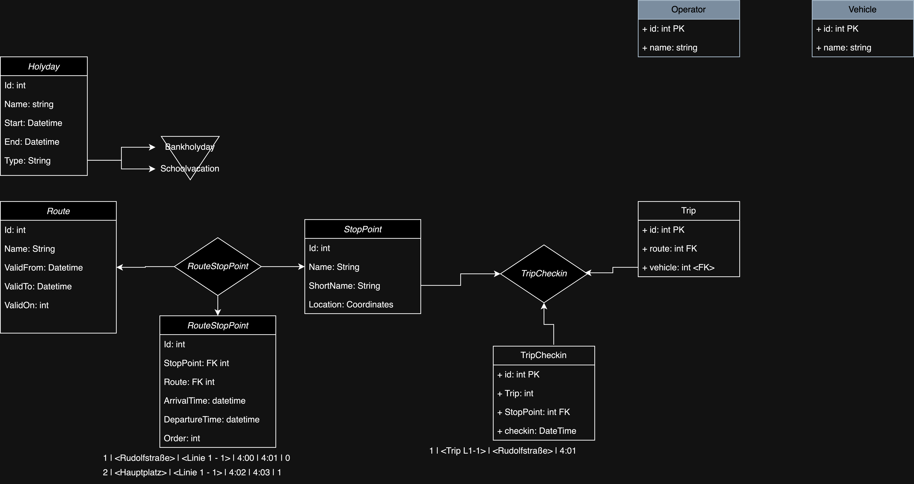

# NextStop

## Das Projekt

Die guten, alten Fahrplanaushänge in den Bushaltestellen haben langsam ausgedient: 
Apps, APIs und digitale Anzeigetafeln übernehmen. 
Sie entwickeln in diesem Projekt einen Fahrplan für öffentliche Verkehrsmittel und benachrichtigen die wartenden Fahrgäste über etwaige Verspätungen.

## Setup

Dieses Projekt ist über 2 Repositories verteilt. 
Aufgrund der GitHub Classroom limitation von GitHub Actions lebt der ursprüngliche Code in diesem Repo: [AstralJaeger/NextStop-SWK-2024](https://github.com/AstralJaeger/NextStop-SWK-2024). 
Die Abgabe lebt hier: [swk-20242ws/nextstop-bb-g1-kamarauli-g2-hillebrand](https://github.com/swk5-2024ws/nextstop-bb-g1-kamarauli-g2-hillebrand) und wird von GitHub Actions bei jedem merge auf den Master von dem ausgangsrepository gepusht.

## Testdaten

Die Testdaten des Projektes wurden aus den Fahrplänen der LinzAG für die Stadt Linz erstellt:
- [LinzAG Netzlinienplan](https://www.linzag.at/media/dokumente/linien_1/infomaterial_1/linien-linienfahrplan.pdf)
- [LinzAG Fahrplan](https://www.linzag.at/media/dokumente/linien_1/infomaterial_1/linien-linienfahrplan.pdf)

## Dokumentation

1. Für welches Datenmodell haben Sie sich entschieden? ER-Diagramm, etwaige Besonderheiten erklären.



Eine Besonderheit ist das ``valid_on`` Attribut bei Routen, es handelt sich um ein Bitfeld welches die Gültigkeiten der Routen an den Wochentagen/Feiertagen/etc speichert. 

2. Dokumentieren Sie auf Request-Ebene den gesamten Workflow anhand eines möglichst durchgängigen Beispiels (vom Einpflegen der Haltestellen und Feiertage bis zur Planung und Durchführung einer Fahrt). Sie können ein Tool Ihrer Wahl einsetzen, z. B. Postman Workflows, VS Code, etc. HTTP-Requests inkl. HTTP-Verb, URL, Parametern, Body und Headern

Route hinzufügen
```
HTTP-Verb: POST
URL: /api/Route
Body:
{
        "id": 0,
        "name": "string",
        "validFrom": "2024-12-22",
        "validTo": "2024-12-22",
        "validOn": 0
}
```

5. Wie stellen Sie sicher, dass das Einchecken der Busse nur mit einem gültigen API-Key möglich ist?

Authentifizierung wird über KeyCloak mit einem JWT-Token durchgeführt. 
Der Token wird bei jedem Request im Header mitgeschickt und auf Gültigkeit überprüft.
Im Token sind benötigte Informationen wie die Gruppenzugehörigkeit des Benutzers enthalten.

**Authentifizierung**: Jeder Check-In-Endpunkt verlangt einen API-Schlüssel im Header.
**Validierung**: Der Schlüssel wird serverseitig überprüft.
**Ablaufkontrolle**: API-Keys haben ein Ablaufdatum und können deaktiviert werden.
**Logging**: Fehlgeschlagene Authentifizierungsversuche werden geloggt.

5. Ein Angreifer hat Zugriff auf ein Datenbank-Backup Ihres Produktivsystems bekommen. Welchen Schaden kann er anrichten?

Mögliche Schäden:
   - Zugriff auf vertrauliche Daten.
   - Manipulation von Routen und Fahrplandaten.
   - Erstellung gefälschter Check-Ins.

6. Bei welchen Teilen Ihres Systems ist eine korrekte Funktionsweise aus Ihrer Sicht am kritischsten? Welche Maßnahmen haben Sie getroffen, um sie zu gewährleisten?

Kritische Teile:
- Check-In-Datenverarbeitung.
- Berechnung von Verspätungen.
- Authentifizierung und Autorisierung.

Maßnahmen:
- Authentifizerung über KeyCloak, einen 3rd Party OSS Service welcher über sehr gute Reputation verfügt.

7. Wie haben Sie die Berechnung passender Routen bei Fahrplanabfragen modular umgesetzt? Welche Teile Ihres Codes müssen Sie ändern, um eine andere Variante einzusetzen?

Die Routenberechnung wurde in einem eigenen Projekt als Library umgesetzt, welches ein Standard Interface zur Verfügung stellt. Auf Basis dieses Interface wurde die Routenplanung umgesetzt, in dem eine neue Klasse auf Basis der BaseRouteFinder Klasse implementiert wird. Zusätzliche Parameter können via Builder Pattern in die Implementierten Algorithmen injectiert werden. Der aktuell implementierte Algorithmus ist stark vereinfacht und eine Änderung des Modells ist notwendig, um komplexere Algorithmen zu unterstützen.

8. Welche Prüfungen führen Sie bei einem Check-in (der Standortdaten eines Busses) durch, um die Korrektheit der Daten zu gewährleisten?

Ids müssen positive Ganzzahlen sein und es muss sich um ein gültiges Datum handeln.

9. Wie stellen Sie sicher, dass Ihre API auch in außergewöhnlichen Konstellationen (Jahreswechsel, Zeitumstellung, Feiertag in den Schulferien, etc.) stets korrekte Fahrplandaten liefert?

Jahreswechsel, Feiertage in Schulferien sind mit einem Flagging system abgedeckt und Fahrpläne können für diese leicht definiert werden.
Zeitumstellungen wurden nicht explizit berücksichtigt, nur über die verwendung der System Bibliotheken von C# und Postgres.

10. Bei der Übertragung eines API-Keys auf einen Bus ist etwas schiefgelaufen, der Bus liefert mangels gültiger Authentifizierung keine Check-in-Daten mehr. Überlegen Sie, wie Sie:
        a. dieses Problem im Betrieb mo glichst rasch erkennen können und
        b. Auskunft geben können, seit wann das Problem besteht.

Derzeit ist es schwierig dieses Problem zu erkennen, da keine Überwachung der Check-In-Daten stattfindet.
Eine Lösung wäre eine Prometheus Metrik und ein Alert welcher feuert wenn keine Check-In-Daten mehr ankommen.
Eine andere wäre ein regelmäßiger Check ob die Datenbank noch Check-In-Daten enthält und ein Alert wenn nicht.

11. Denken Sie an die Skalierbarkeit Ihres Projekts: Die Wiener Linien möchten Ihr Produkt mit über 1.000 Fahrzeugen nutzen. Was macht Ihnen am meisten Kopfzerbrechen?

- Datenbanklast durch tausende Fahrten, Routing Queries und Lookups, hier kann mit einer In-Memory Cache wie Redis ausgeholfen werden.
- Check-Ins können mit tausenden Fahrzeugen zu einer hohen Last führen, hier kann mit einer Message Queue wie RabbitMQ oder Kafka gearbeitet werden sowie batch updates in der DB. 
- bessere Observability notwendig.


12. Wenn Sie das Projekt neu anfangen würden – was würden Sie anders machen?

Schlankeres Design und gezieltere APIs implementieren, um gezielt Daten abzufragen zur Verringerung der Datenlast. 
